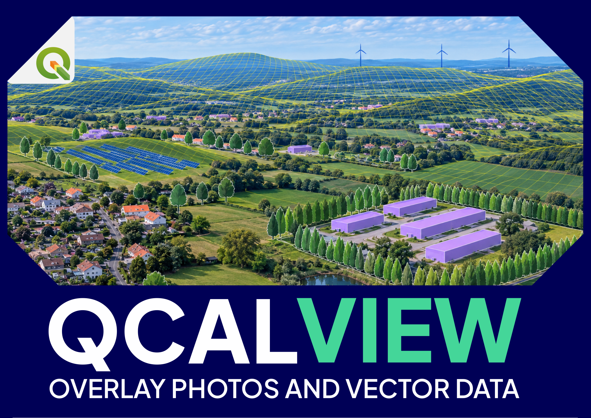

  

# QCALVIEW — ALPHA-40.20.3

**Visual Simulation & Geomatics for QGIS**

QCALVIEW is an open-source QGIS plugin developed by **Fabrice Kerzerho - ArcTan°** for photographic viewpoint calibration, visual simulation, projected GIS overlays and rapid landscape representations directly inside QGIS.

- Project: https://qcalview.com
- ArcTan°: https://arctan.fr
- Contact: contact@arctan.fr

## Compatibility

- QGIS 3.44.x / Qt5
- QGIS 4.x / Qt6

## Experimental status

ALPHA-40.20.3 is an **experimental QGIS plugin**. Interfaces and rendering behaviour may still change. Results should be checked on representative projects before production use.

For public testing, the Experimental Tools tab exposes only:

- Projection grid
- Azimuth ruler
- Interactive monoplotting

Other internal experimental modules remain unavailable in public builds.

## Coordinate systems

A projected project CRS with metric units is recommended for QCALVIEW calculations. Source viewpoint and vector layers may use another correctly declared CRS, including geographic CRS such as EPSG:4326; QGIS on-the-fly transformation is used where supported.

## Current limitations

Pinhole rendering is currently the most mature path. Cylindrical and equirectangular rendering remain experimental, especially for very large scenes, dense textures, depth/occlusion and high-resolution output. Very large images, terrain models and dense vector layers can require substantial memory.

See [Current limitations](docs/limitations.md).

## Documentation

See https://qcalview.com/DOCS/#/ or `docs/` for the user manuals, current limitations and licensing notes.

## Licence

QCALVIEW is licensed under the [GNU GPL v3.0 or later](LICENSE). Copyright © 2026 Fabrice Kerzerho — ArcTan°.

Redistributions should retain the applicable attribution described in [NOTICE](NOTICE). QCALVIEW, ArcTan° and their associated logos/visual identity are subject to the [trademark policy](TRADEMARKS.md).
