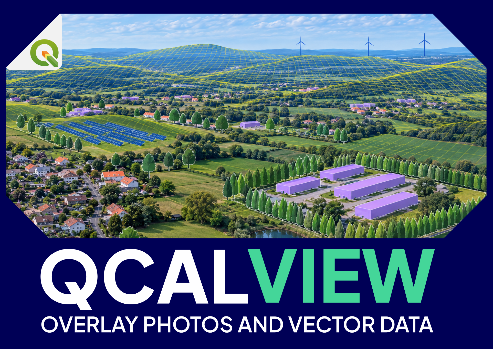

  

# QCALVIEW | 40.21

**Visual Simulation & Geomatics for QGIS**

QCALVIEW is an open-source QGIS plugin developed by **Fabrice Kerzerho - ArcTan°** for photographic viewpoint calibration, visual simulation, projected GIS overlays and rapid landscape representations directly inside QGIS.

- Project: https://qcalview.com
- ArcTan°: https://arctan.fr
- Contact: contact@arctan.fr

## Rendering prerequisite

**Terrain raster required for rendering.** QCALVIEW requires an explicitly selected DEM/DTM/DSM raster in **Relief > Raster MNT/MNS** before any preview or visual export can be rendered. Merely having a raster in the QGIS project is not sufficient.

## Compatibility

- QGIS 3.44.x / Qt5
- QGIS 4.x / Qt6

## Release status

QCALVIEW 40.21 is prepared for publication on the standard QGIS plugin channel. Core calibration, projected-layer, terrain, viewer and export workflows are available as regular plugin functionality. Some optional advanced tools remain explicitly marked as experimental and may still evolve. Results should always be checked on representative projects before production use.

The Experimental Tools tab currently exposes:

- Projection grid
- Azimuth ruler
- Interactive monoplotting

Other internal development modules remain unavailable in public builds.

## Coordinate systems

A projected project CRS with metric units is recommended for QCALVIEW calculations. Source viewpoint and vector layers may use another correctly declared CRS, including geographic CRS such as EPSG:4326; QGIS on-the-fly transformation is used where supported.

## Current limitations

Pinhole rendering is currently the most mature path. Cylindrical and equirectangular rendering remain experimental, especially for very large scenes, dense textures, depth/occlusion and high-resolution output. Very large images, terrain models and dense vector layers can require substantial memory.

See [Current limitations](docs/limitations.md).

## Documentation

See `docs/`  or https://qcalview.com/DOCS/#/ for the user manuals, current limitations and licensing notes.

## Licence

QCALVIEW is licensed under the [GNU GPL v3.0 or later](LICENSE). Copyright © 2026 Fabrice Kerzerho - ArcTan°.

Redistributions should retain the applicable attribution described in [NOTICE](NOTICE). QCALVIEW, ArcTan° and their associated logos/visual identity are subject to the [trademark policy](TRADEMARKS.md).
